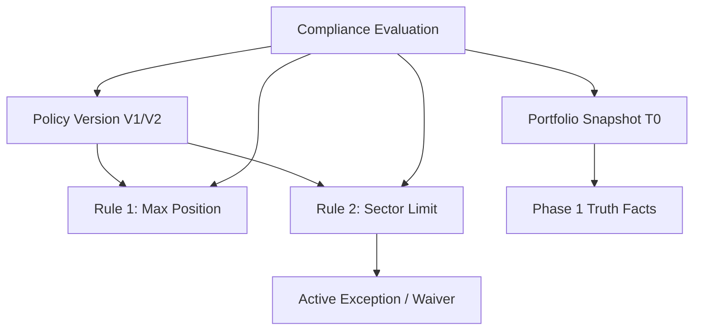

# Phase 16 — Institutional Audit Model & Evidence Graph Specification

## 1. Audit Evidence Graph

Every compliance evaluation constructs a deterministic, directed acyclic evidence graph (DAG):



## 2. Sealed Intelligence Package

The `ComplianceIntelligencePackage` is cryptographically sealed with a SHA-256 canonical hash:

```json
{
  "packageId": "PKG-CMP-PORTFOLIO-1-1772890000000",
  "packageVersion": "1.0.0",
  "workspaceId": "WS-INST-1",
  "portfolioId": "PORTFOLIO-1",
  "asOf": "2026-09-06T12:00:00.000Z",
  "complianceStatus": "PASS",
  "isCompliant": true,
  "overallSeverity": "INFO",
  "policy": {
    "policyId": "POL-GLOBAL-GROWTH",
    "policyVersion": "1.0.0",
    "policyHash": "sha256-..."
  },
  "evaluationSummary": {
    "totalRules": 15,
    "passedRules": 15,
    "warningRules": 0,
    "breachedRules": 0,
    "waivedRules": 0,
    "insufficientDataRules": 0
  },
  "packageHash": "sha256-..."
}
```

## 3. Append-Only Integration

Compliance events (policy creations, evaluations, breach transitions, exception approvals) are appended to the Phase 9 immutable audit log (`server/governance/audit.repository.js`) without creating a disconnected or incompatible second audit log.
