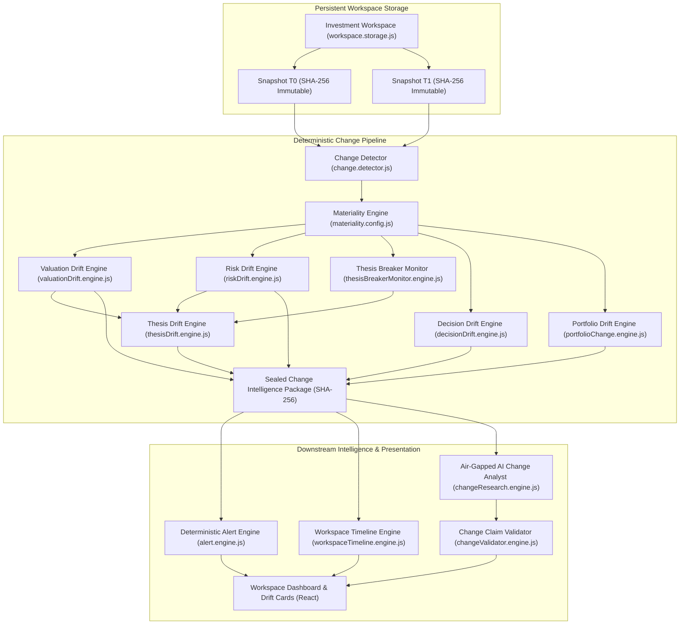

# Phase 5 Architecture: Persistent Investment Workspace & Change Intelligence

## 1. Executive Overview

Phase 5 upgrades InvestmentAI from a point-in-time financial analysis dashboard into an institutional, persistent investment workspace capable of tracking financial, valuation, risk, and thesis drift over time while maintaining strict deterministic truth and air-gapped AI boundaries.

### Core Institutional Value Proposition
> **"What changed since I last looked at this investment, why does it matter, and does that change my thesis or decision?"**

---

## 2. End-to-End System Architecture



---

## 3. Persistent Workspace & Snapshot Lifecycle

### 3.1 Immutable Snapshot Model (`InvestmentSnapshot`)
Every analysis run can become an immutable snapshot ($T_0, T_1, T_2, \dots$). Snapshots are never mutated in place.

```json
{
  "snapshotId": "SNAP_AAPL_1757123456",
  "workspaceId": "WS_DEFAULT",
  "ticker": "AAPL",
  "asOf": "2026-09-01",
  "createdAt": "2026-09-01T00:00:00.000Z",
  "snapshotHash": "a4f8...64hex",
  "truthPackageHash": "b3e2...64hex",
  "truthPackageVersion": "1.0.0",
  "marketState": { "currentPrice": 150.0, "marketCap": 2.5e12, "beta": 1.2 },
  "financialState": { "revenue": 400e9, "fcf": 100e9, "operatingMargin": 0.30, "debtToEbitda": 1.2 },
  "valuationState": { "compositeFairValue": 180.0, "dcfFairValue": 180.0, "reverseDcfGrowth": 8.5 },
  "riskState": { "overallScore": 25, "overallCategory": "LOW" },
  "decisionState": { "decision": "BUY", "convictionScore": 85 },
  "thesisState": { "summary": "Durable cash flow generator" },
  "thesisBreakerState": [
    {
      "trigger": "Operating Margin Deterioration below 27.0%",
      "currentValue": "30.0%",
      "threshold": "27.0%",
      "status": "NOT_TRIGGERED"
    }
  ]
}
```

### 3.2 Cryptographic Immutability
- Snapshots are serialized using deep recursive canonical JSON ordering (`canonicalStringify`) and hashed via SHA-256.
- Attempts to overwrite existing snapshots or alter historical fields are rejected with `Immutability violation` and hash verification failures.

---

## 4. Deterministic Change & Materiality Pipeline

### 4.1 20 Change Categories
1. `PRICE`
2. `REVENUE`
3. `EARNINGS`
4. `FREE_CASH_FLOW`
5. `MARGINS`
6. `DEBT`
7. `CASH`
8. `LEVERAGE`
9. `LIQUIDITY`
10. `VALUATION`
11. `RISK`
12. `BETA`
13. `VOLATILITY`
14. `RELATIVE_VALUATION`
15. `REVERSE_DCF`
16. `CATALYST`
17. `THESIS`
18. `THESIS_BREAKER`
19. `DECISION`
20. `DATA_QUALITY`

### 4.2 Centralized Materiality Engine (`materiality.config.js`)
| Category | Materiality Threshold | Critical Threshold | Rationale |
| :--- | :--- | :--- | :--- |
| **Price** | $> 5.0\%$ | $> 20.0\%$ | Shifts margin of safety |
| **Revenue** | $> 5.0\%$ | $> 15.0\%$ | Signals top-line acceleration or slowing |
| **Free Cash Flow** | $> 10.0\%$ | $> 25.0\%$ | Directly alters DCF valuation |
| **Margins** | $> 150\text{ bps}$ | $> 300\text{ bps}$ | Pricing pressure or cost inflation |
| **Net Debt** | $> 10.0\%$ | $> 30.0\%$ | Balance sheet leverage expansion |
| **Valuation (DCF)** | $> 8.0\%$ | $> 20.0\%$ | Intrinsic fair value shifts |
| **Risk Transition** | Any state transition | Transition to CRITICAL | Systemic risk elevation |
| **Decision Transition** | Any decision change | Transition to AVOID | Direct capital allocation downgrade |

---

## 5. Multi-Dimensional Drift Engines

### 5.1 Valuation Drift Engine
- Compares DCF Fair Value, Composite Fair Value, and Reverse DCF Implied Growth rate.
- Formula: $\Delta\% = \frac{FV_{T1} - FV_{T0}}{FV_{T0}} \times 100$.
- Classifies direction as `IMPROVING`, `DETERIORATING`, or `NEUTRAL`.

### 5.2 Risk Drift Engine
- Tracks transitions across all 9 risk dimensions (`market`, `financial`, `liquidity`, `earningsQuality`, `growth`, `valuation`, `event`, `governance`, `dataQuality`).
- Evaluates transition matrix severity (e.g. `LOW` $\rightarrow$ `HIGH` flagged as `CRITICAL`).

### 5.3 Persistent Thesis Breaker Monitoring
- Tracks falsification triggers generated in Phase 4.
- Evaluates status dynamically: `NOT_TRIGGERED`, `APPROACHING`, `TRIGGERED`, `RESOLVED`.

### 5.4 Thesis Drift Engine
- Synthesizes 5 fundamental pillars: Growth, Profitability, Valuation, Balance Sheet, Risk.
- Deterministic outcomes:
  - `THESIS_STRENGTHENED` (positive pillars dominate)
  - `THESIS_WEAKENED` (negative pillars dominate)
  - `THESIS_MIXED` (balanced positive & negative changes)
  - `THESIS_INVALIDATED` (triggered thesis breaker)
  - `THESIS_RECOVERY` (previously broken thesis resolved)
  - `THESIS_UNCHANGED` (no material deviation)

### 5.5 Decision Drift Engine
- Evaluates categorical rating changes (`BUY` $\rightarrow$ `HOLD` $\rightarrow$ `WATCH` $\rightarrow$ `AVOID`).
- Computes conviction score deltas and documents primary drivers.

---

## 6. AI Boundary & Claim Validation

### 6.1 Sealed Change Intelligence Package
The AI temporal analyst receives **strictly** the sealed `ChangeIntelligencePackage` with its SHA-256 seal. It is air-gapped from raw unparsed historical files or web queries.

### 6.2 Claim Validation (`changeValidator.engine.js`)
- Every AI statement regarding a historical change must cite a verified `changeId` from the sealed package.
- Hallucinated metrics (e.g. fake FCF spikes) or fabricated sources are tagged as `UNGROUNDED` and rejected.
- AI is prohibited from overriding deterministic decision transitions or thesis drift status.

---

## 7. API Design

| Method | Endpoint | Description |
| :--- | :--- | :--- |
| `GET` | `/api/workspaces` | List all workspaces |
| `POST` | `/api/workspaces` | Create persistent workspace |
| `GET` | `/api/workspaces/:workspaceId` | Get workspace details |
| `POST` | `/api/workspaces/:workspaceId/watchlist` | Add ticker to watchlist |
| `DELETE` | `/api/workspaces/:workspaceId/watchlist/:ticker` | Remove ticker from watchlist |
| `POST` | `/api/workspaces/:workspaceId/snapshot/:ticker` | Ingest new snapshot & run change pipeline |
| `GET` | `/api/workspaces/:workspaceId/snapshots/:ticker` | Retrieve immutable snapshot history |
| `GET` | `/api/workspaces/:workspaceId/timeline/:ticker` | Retrieve chronological timeline events |
| `GET` | `/api/workspaces/:workspaceId/changes/:ticker` | Retrieve differential change report (T0 vs T1) |
| `POST` | `/api/workspaces/:workspaceId/changes/:ticker/question` | AI temporal research Q&A |
| `GET` | `/api/workspaces/:workspaceId/alerts` | List active workspace alerts |
| `POST` | `/api/workspaces/:workspaceId/alerts/:alertId/ack` | Acknowledge alert |

---

## 8. Frontend User Experience (`/workspace`)

The persistent workspace frontend located in `client/src/components/Workspace/` provides:
1. **Watchlist & Active Alerts Center**: Real-time asset monitoring and high-priority alert acknowledgements.
2. **Side-by-Side Metric Differences (`ChangeSummaryCard`)**: Explicit comparison of T0 vs T1 values with materiality badges.
3. **Multi-Dimensional Drift Cards**:
   - `ThesisDriftCard`: Status, pillar breakdown, and drivers.
   - `ValuationDriftCard`: DCF fair value variance and Reverse DCF growth shift.
   - `RiskDriftCard`: Category transitions matrix.
   - `ThesisBreakerMonitor`: Real-time proximity to threshold breaches.
4. **AI Temporal Analyst Q&A**: Air-gapped question answering over verified change evidence.
5. **Interactive Chronological Timeline (`InvestmentTimeline`)**: Historical events with severity levels and evidence citations.
6. **Immutable Snapshot Drawer (`SnapshotHistory`)**: Cryptographic SHA-256 hashes for full historical auditability.
